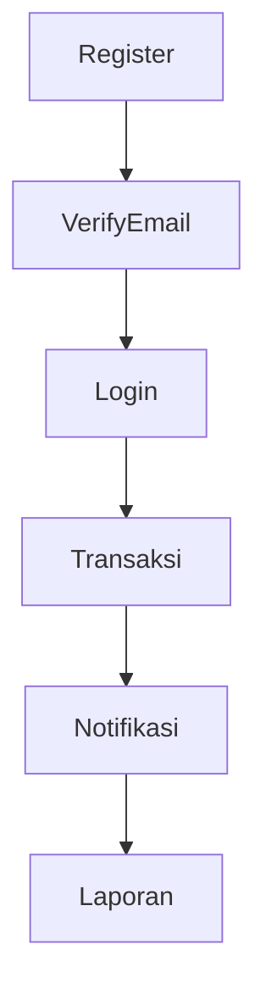
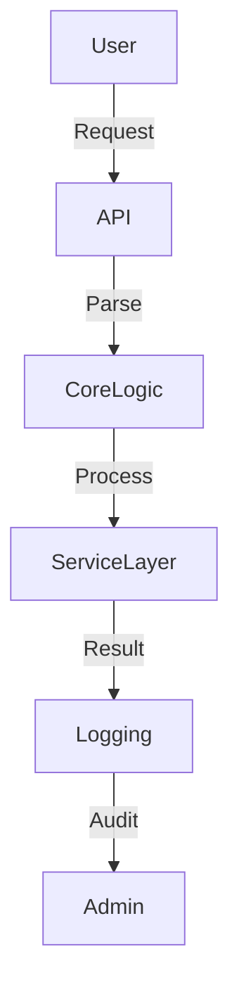

# Architecture Plan

## System Overview
Struktur sistem dan alur komunikasi antar komponen.

---

## Business Process

Alur utama proses bisnis aplikasi ini:

1. User melakukan registrasi.
2. Sistem melakukan verifikasi email.
3. User login dan mengakses fitur utama.
4. User melakukan transaksi.
5. Sistem mencatat transaksi dan mengirim notifikasi.
6. Admin dapat melihat laporan transaksi.

### Sample Flowchart


### Sample Overview
Sistem terdiri dari beberapa modul utama: API, Core Logic, Service Layer, dan Logging. Data dari user masuk ke API, diproses oleh Core Logic, diteruskan ke Service Layer, dan hasilnya dicatat di Logging.

## Visual Diagram (Sample)

*Diagram di atas adalah contoh alur data dari user ke sistem dan logging.*


## Modules
Daftar modul utama + tanggung jawabnya.

### Sample Modules
- **API Module**
  Menangani request dari user, validasi input, dan routing ke core logic.
  ```python
  # api_module.py
  def handle_request(request):
      # Validasi dan parsing
      data = parse_request(request)
      result = process_core(data)
      return result
  ```
- **Core Logic**
  Memproses data, menjalankan algoritma utama, dan mengatur workflow.
  ```python
  # core_logic.py
  def process_core(data):
      # Proses utama
      output = run_algorithm(data)
      return output
  ```
- **Service Layer**
  Integrasi dengan service eksternal (misal: database, API lain).
  ```python
  # service_layer.py
  def save_to_db(output):
      # Simpan hasil ke database
      db.insert(output)
  ```
- **Logging**
  Mencatat semua aktivitas dan error ke folder `/logs/`.
  ```python
  # logging_util.py
  def log_event(event):
      with open("logs/service/2025-11-XX.log", "a") as f:
          f.write(f"[timestamp] [INFO] {event}\n")
  ```


## Data Flow
Bagaimana data bergerak antar modul.

---

## Database Schema

Dokumentasikan struktur tabel utama yang berlaku untuk banyak jenis proyek (user, transaksi, dsb).

### Contoh Minimal Schema

- Tabel: users (id, username, email, password_hash, created_at)
- Tabel: transactions (id, user_id, amount, date, status)

### Sample DDL

```sql
CREATE TABLE users (
  id SERIAL PRIMARY KEY,
  username VARCHAR(50) NOT NULL,
  email VARCHAR(100) NOT NULL,
  password_hash TEXT NOT NULL,
  created_at TIMESTAMP DEFAULT CURRENT_TIMESTAMP
);

CREATE TABLE transactions (
  id SERIAL PRIMARY KEY,
  user_id INTEGER REFERENCES users(id),
  amount NUMERIC(12,2) NOT NULL,
  date TIMESTAMP DEFAULT CURRENT_TIMESTAMP,
  status VARCHAR(20) NOT NULL
);
```

### Sample Data Flow
1. User mengirim request ke API.
2. API melakukan validasi dan parsing.
3. Data diteruskan ke Core Logic untuk diproses.
4. Hasil proses dikirim ke Service Layer untuk disimpan atau diteruskan ke eksternal.
5. Semua aktivitas dicatat di modul Logging.

#### Sample Log Output
```
[2025-11-XX 10:00:00] [INFO] Request received from user_id=123
[2025-11-XX 10:00:01] [INFO] Data processed successfully
[2025-11-XX 10:00:02] [ERROR] Failed to save to database: ConnectionTimeout
```


## Dependencies
Library eksternal atau API pihak ketiga.

## Security Considerations
Pastikan arsitektur mendukung keamanan data dan anti-manipulasi.
- Setiap modul harus memvalidasi input dan output.
- Hindari single point of failure untuk data sensitif.
- Gunakan enkripsi untuk komunikasi antar modul jika diperlukan.
- Dokumentasikan dependensi eksternal yang berpotensi risiko.

## Folder Structure
```

src/
┣ core/
┣ api/
┣ services/
┣ utils/
┗ logs/
