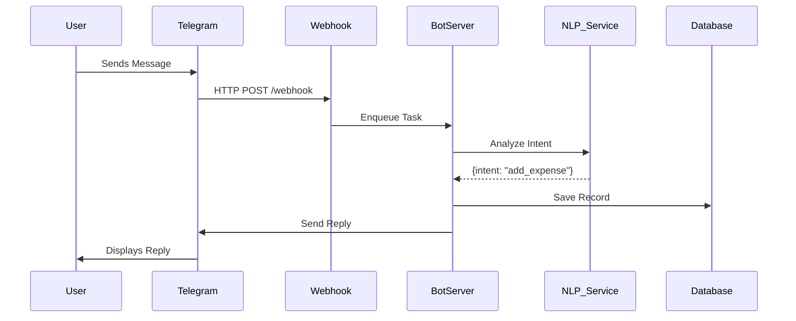

# 04. Bot Architecture

## 4.1 High-Level Design

## 4.2 Technology Stack
- **Language**: Python (python-telegram-bot) or Node.js (Telegraf).
- **Queue**: Redis + Celery/Bull (for handling heavy tasks without blocking).
- **DB**: SQLite (Dev) / PostgreSQL (Prod).

## 4.3 State Management (FSM)
- Uses a Finite State Machine to track conversation progress.
- States: `IDLE`, `AWAITING_CATEGORY`, `AWAITING_CONFIRMATION`.
- Storage: Redis keys `user:{id}:state`.
