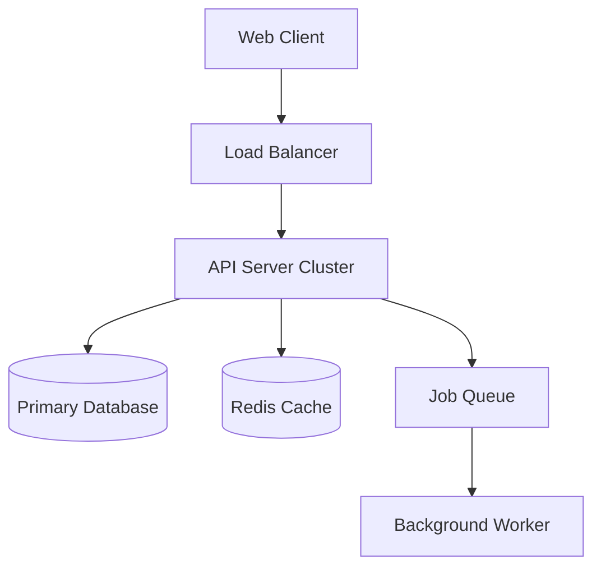

# 04. System Architecture

## 4.1 High-Level Design
*Describe the tiered architecture.*
- **Presentation Layer**: SPA (Single Page Application) or SSR (Server Side Rendering).
- **Application Layer**: REST/GraphQL API.
- **Data Layer**: Relational Database + Cache.



## 4.2 Technology Stack
| Component | Technology | Version/Note |
| :--- | :--- | :--- |
| Frontend | Next.js / React | Latest Stable |
| Backend | Node.js (NestJS) / Python (FastAPI) | |
| Database | PostgreSQL | |
| Cache | Redis | |
| Infrastructure | Docker / Kubernetes | |

## 4.3 Data Flow
1.  User requests data.
2.  Frontend calls `/api/data`.
3.  Backend checks Cache.
    - If hit: return data.
    - If miss: Query DB, populate Cache, return data.

## 4.4 Directory Structure
```
/src
  /components  # UI components
  /hooks       # Custom hooks
  /pages       # Routes
  /services    # API calls
  /utils       # Helpers
```
