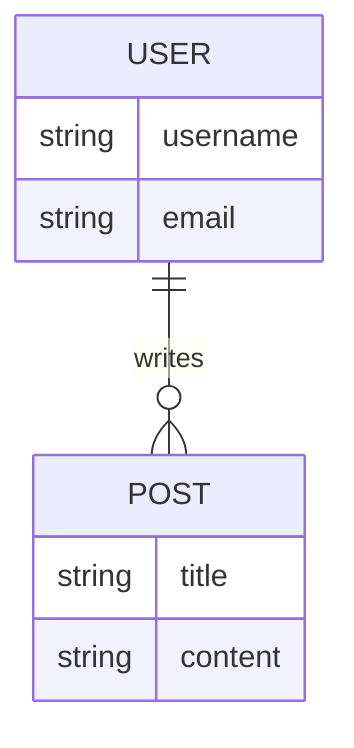

# 2. System Architecture

## 2.1 Tech Stack
*   **Frontend**: [e.g., React, Vue, Next.js]
*   **Backend**: [e.g., Node.js, Python/FastAPI, Go]
*   **Database**: [e.g., PostgreSQL, MongoDB]
*   **Cache**: [e.g., Redis]

## 2.2 High-Level Architecture
*Describe how components interact (Client <-> Load Balancer <-> API <-> DB).*

## 2.3 Database Schema

## 2.4 Directory Structure
*Define the codebase structure convention.*
